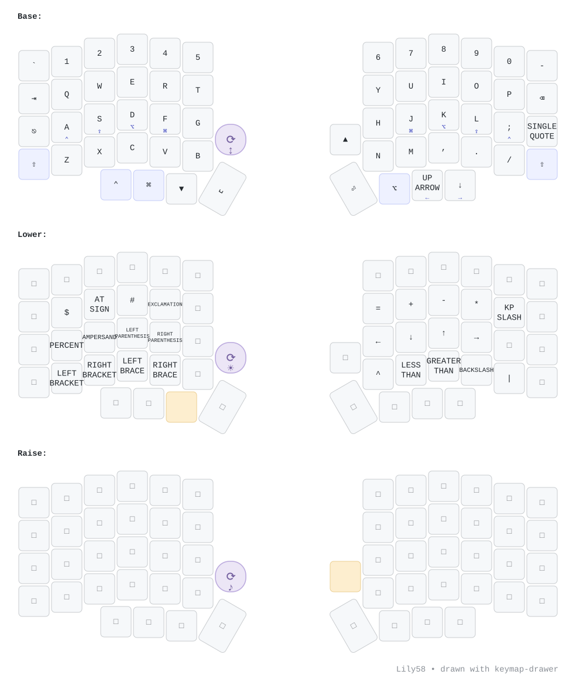

<div align="center">

# Lily58 Wireless — ZMK Config

**Typeractive Lily58 · nice!nano v2 · nice!view · Kailh Choc Sunset · custom 3D-printed case**

[](https://github.com/KrishPatel1404/lily58-zmk-config/actions/workflows/build.yml)


</div>

---

## ⌨️ The Build

| | |
|---|---|
| **Keyboard** | [Typeractive Lily58 wireless](https://typeractive.xyz/products/lily58-partially-assembled-pcb) — 58-key column-staggered split (6×4+4 per half), designed by [kata0510](https://github.com/kata0510/Lily58) |
| **Controllers** | 2× [nice!nano v2](https://nicekeyboards.com/docs/nice-nano/) (nRF52840, BLE 5, UF2 bootloader) |
| **Displays** | 2× [nice!view](https://nicekeyboards.com/docs/nice-view/) — Sharp memory-in-pixel LCD, ~1000× less power than OLED. Stock ZMK `nice_view` widget (battery, output/profile, layer, WPM) |
| **Switches** | 60× Kailh **Choc Sunset** tactile — 40 gf actuation, 55 gf bump, 3.0 mm travel, factory-lubed |
| **Keycaps** | Blank Choc v1, all white — 8× convex 1u (thumbs), 2× homing 1u, 2× 1.5u, rest 1u |
| **Batteries** | 2× 1800 mAh LIP1359 (PS3-controller replacement cells) — months per charge |
| **Case** | Custom CAD-modeled faceplate + bottom shell, 3.25° typing angle, printed in white |
| **Encoder** | 1× **EC12 rotary encoder, no push button** on the **left** half — hand-soldered to the left nice!nano v2's `P0.31` (A) + `P0.29` (B) pads, common to `GND` |

## 🗺️ Keymap

<div align="center">



</div>

3 layers (Base / Lower / Raise) + 3 reserved slots for adding layers live in ZMK Studio. No homerow mods, no combos.

Left encoder (the violet ⟳ key): **Base** = page up/down · **Lower** = brightness · **Raise** = volume.

Edit with [ZMK Studio](https://zmk.studio), [Keymap Editor](https://nickcoutsos.github.io/keymap-editor/), or [`config/lily58.keymap`](config/lily58.keymap).

## 🔨 Building & Flashing

Firmware-relevant pushes build in CI ([ZMK v0.3](https://github.com/zmkfirmware/zmk/releases)); successful main builds auto-publish to [**Releases**](../../releases).

1. Grab `lily58_left.uf2` / `lily58_right.uf2` from the [latest release](../../releases/latest)
2. Plug a half in via USB-C, **double-tap the reset button** → it mounts as a `NICENANO` drive
3. Drag the matching `.uf2` on (left file → left half, right → right)

> Keymap-only changes usually need just the **left** (central) half reflashed. Anything touching split behavior: flash both.

**Halves not pairing?** Flash `settings_reset.uf2` (Actions `firmware` artifact) to both halves, then re-flash normal firmware.

## 🔋 Battery Notes

- Both halves report their own battery on their own screen; the left half also proxies the right half's level to the host, so macOS shows both under Bluetooth.
- **Deep sleep is off** and the BLE connection is pinned to a 7.5 ms interval with no skipped events (lowest latency ZMK can ask for) — so real runtime is well under the [power profiler](https://zmk.dev/power-profiler)'s ~4 months central / ~1 year peripheral estimate. Raise `CONFIG_BT_PERIPHERAL_PREF_LATENCY` in `lily58.conf` to trade latency back for runtime.
- Charges via USB-C at 100 mA — full charge takes overnight.

**⚠️ Battery safety:** replacement-pack polarity isn't standardized — multimeter-verify red/+ lands on **B+** before connecting (reversed = dead board, fire risk). nice!nano has no low-voltage cutoff; use packs with a protection circuit.

## 📁 Repo Layout

```
build.yaml                    # build matrix: left/right + nice!view (+ Studio snippet), settings_reset
config/
  lily58.keymap               # layers + encoder sensor-bindings
  lily58.conf                 # Kconfig: BT power + low-latency conn, debounce, display, battery, Studio, encoder
  lily58_left.conf            # central-half only: 3 BLE host profiles
  west.yml                    # ZMK pinned to v0.3
keymap-drawer/
  config.yaml                 # keymap diagram styling (hand-written)
  lily58.svg / lily58.yaml    # auto-generated diagram (CI output — don't hand-edit)
.github/workflows/
  build.yml                   # CI → zmkfirmware reusable build workflow
  draw-keymaps.yml            # CI → keymap-drawer diagram render
```

## 🔗 Links

[Typeractive build guide](https://docs.typeractive.xyz/build-guides/lily58-wireless) · [firmware guide](https://docs.typeractive.xyz/build-guides/lily58-wireless/firmware) · [ZMK docs](https://zmk.dev/) · [ZMK GitHub](https://github.com/zmkfirmware) · [Lily58 upstream](https://github.com/kata0510/Lily58) · [keymap-drawer](https://github.com/caksoylar/keymap-drawer)
